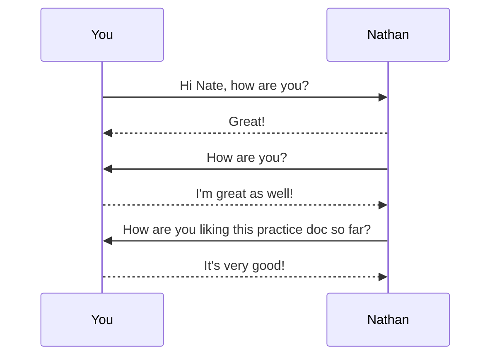

# Welcome to my GitHub Markdown Practice Document

Here is a paragraph with a **bolded** word and a _italicized_ word

~~This line is a mistake~~

**This text is _important_ since it's all bold**

***This text is extremely important since it's all bold and italics***

This is some <sub>subscript</sub> text

This is some <sup>superscript</sup> text

Here is a couple interesting quotes

---
> What doesn't kill you, simply makes you, stranger.
---
<p>- Joker (The Dark Knight)</p>

---
> Happiness is not the absence of problems. It's the ability to deal with them.
---
<p>- Steve Maraboli</p>


<h2>Here are some commands that I use for transfering, updating, and pushing files to github</h2>

- `git clone repoURL`
- `git add .`
- `git status`
- `git commit -m "Message Here"`
- `git push`

<h3>Here are code snippets to display a welcome text in multiple languages</h3>

``` javascript
// javascript
function printGreeting() {
  console.log("Hello! Welcome to Nate's GitHub Markdown Practice Document");
}
```

``` java
// Java
static void printGreeting() {
  System.out.println("Hello! Welcome to Nate's GitHub Markdown Practice Document");
}
```

``` python
# Python
def printGreeting():
  print("Hello! Welcome to Nate's GitHub Markdown Practice Document")
```

``` cpp
// C++
void printGreeting() {
  std::cout << "Hello! Welcome to Nate's GitHub Markdown Practice Document" << std::endl;
}
```

## Here is a table with some programming languages and the year they were created

| **Programming Language** | **Year** |
| --- | --- |
| Java | 1995 |
| Javascript | 1995 |
| C | 1972 |
| C++ | 1983 |
| Objective C | 1986 |
| Perl | 1987 |
| Python | 1990 |
| Ruby | 1995 |
| PHP | 1995 |
| C# | 2001 |
| Kotlin | 2011 |
| Typescript | 2012 |
| Swift | 2014 |

## Take a look at Seneca College's Largest Campus -- Newnham

```geojson
{
  "type": "FeatureCollection",
  "features": [
    {
      "type": "Feature",
      "properties": {},
      "geometry": {
        "coordinates": [
          [
            [
              -79.35036155964913,
              43.79389251211552
            ],
            [
              -79.34611323694743,
              43.794976460903484
            ],
            [
              -79.34515062606339,
              43.79792247878078
            ],
            [
              -79.34595916529031,
              43.799247255089966
            ],
            [
              -79.35446864550542,
              43.79737594356138
            ],
            [
              -79.35188650923894,
              43.79533187746031
            ],
            [
              -79.35036155964913,
              43.79389251211552
            ]
          ]
        ],
        "type": "Polygon"
      }
    }
  ]
}
```


## Heres a small sequence diagram showing our current communication!




### Hi Image

[](https://www.merriam-webster.com/dictionary/hi "Link to definition of Hi")

# Closing Checklist

- [x] Review GitHub Markdown
- [x] Check out the map
- [x] See our communications
- [ ] Enjoyed Doc?
  - [ ] If yes, view my other repos!

